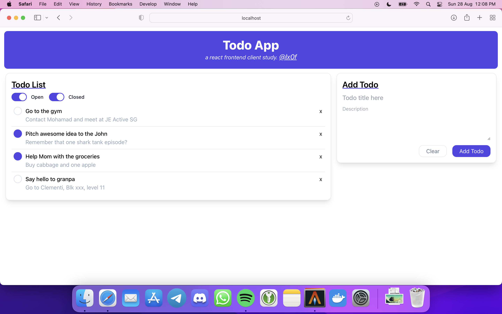
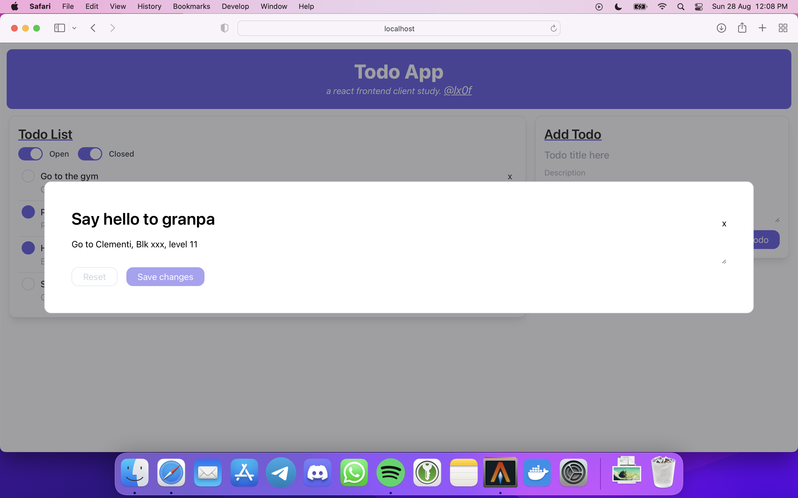
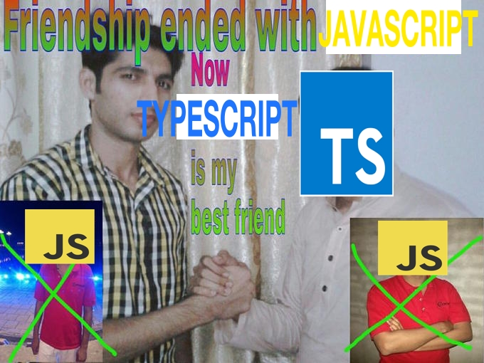

# Todo App: a react frontend client study

## [Client video showcase](https://imgur.com/a/HBJLxDH)

## About

- Serves as presentation layer for the Todo solution
- Connected with external ASP.NET Web API
- Dynamically change Todo details **in place**
- **Easily** filter open or closed Todo items

## Used

- [React](https://reactjs.org)
- [TypeScript](https://www.typescriptlang.org)
- [Tailwindcss](https://tailwindcss.com)
- [Axios](https://axios-http.com)

---

## Remarks

Although the purpose of this project was to learn about react, I found out that developing in TypeScript was really fun!! 10/10 would do again. Best thing is that it made me feel safe and loved so now I no longer have to stay in my abusive relationship with JavaScript 🤮

### P.S.

i love react.js too <3 (meta please hire me)
